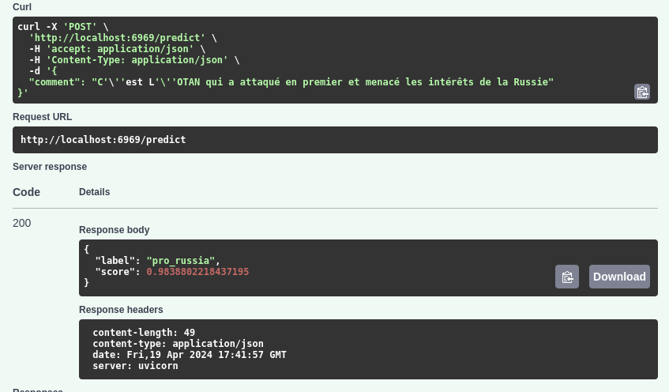

## Lmd-Comment Classification API (Docker, FastAPI)


> **Note:** Containerize and deploy a FastAPI app that serves a quantized ONNX model for classifying comments from Le Monde about the Ukraine invasion. At build time, the model and tokenizer are directly downloaded from the specified Huggingface repository. Model (performance, quantization, LLM fine-tuning vs. NN etc.) is detailed in this [project](https://github.com/matthieuvion/lmd_classi). Model is optimized for CPU and inference engine is Huggingface `Optimum.onnxruntime`.




### Project / app structure

```
lmd-fastapi-docker/
│
├── app/
│   ├── main.py              # FastAPI app setup, routes
│   └── model/               # Model files directory (populated at build)
│
├── download_model.py        # Script to download the model from HuggingFace
├── requirements.txt         # Python dependencies
├── Dockerfile               # Defines steps to build the Docker image
```

### Installation

Make sure Docker is installed on your machine.

1. **Clone the repository**

```bash
git clone https://github.com/matthieuvion/lmd-fastapi-docker.git
cd lmd-fastapi-docker
```

2. **Build the Docker image**

This command builds the Docker image, downloading the necessary Python packages and the ONNX model into the image.

```bash
docker build -t lmd-comment-classifier .
```

### Running the Container

Run the following command to start the container. The FastAPI server will start and listen for requests on port 5100. If Docker-desktop is installed on your machine, built image should be displayed and ran from there.

```bash
docker run -p 5100:5100 lmd-comment-classifier
```

You can then navigate to `http://localhost:5100/docs` in your web browser to interact with the API (specifically the /predict endpoint)

### Key Files Explained

#### `Dockerfile`

This file is used to build the Docker image of our application. It is based on the `tiangolo/uvicorn-gunicorn-fastapi:python3.9` image, which is a pre-configured, minimal image with Uvicorn served via Gunicorn for high performance.

```docker
FROM tiangolo/uvicorn-gunicorn-fastapi:python3.9

WORKDIR /app
COPY ./requirements.txt /app/requirements.txt
RUN pip install --no-cache-dir --upgrade -r /app/requirements.txt

COPY ./app /app/app
RUN mkdir -p /app/app/model
COPY ./download_model.py /app/app/download_model.py
RUN python /app/app/download_model.py

EXPOSE 5100
CMD ["uvicorn", "app.main:app", "--host", "0.0.0.0", "--port", "5100"]
```

#### `app/main.py`

Defines the FastAPI application setup, endpoints, and model loading mechanisms.

```python
from pathlib import Path
from fastapi import FastAPI
from pydantic import BaseModel
from transformers import AutoTokenizer
from optimum.onnxruntime import ORTModelForSequenceClassification

app = FastAPI(title="LMD Comment Classification API", version="0.1.0")

MODEL_DIR = Path(__file__).resolve(strict=True).parent / "model"
model, tokenizer = load_model(MODEL_DIR)

@app.get("/")
def home():
    return {"message": "Classifier ready to receive comments"}

@app.post("/predict", response_model=Prediction)
def predict(payload: TextIn):
    clf = pipeline("text-classification", model=model, tokenizer=tokenizer)
    return clf(payload.comment)[0]
```

#### `download_model.py`

This script is executed during the Docker image build process. It downloads the model and tokenizer files from HuggingFace to the container's filesystem. You could simply copy your model locally and tweak your Dockerfile accordingly instead.

```python
from pathlib import Path
from optimum.onnxruntime import ORTModelForSequenceClassification
from transformers import AutoTokenizer

BASE_DIR = Path(__file__).resolve(strict=True).parent
MODEL_DIR = BASE_DIR / "model"
MODEL_NAME = "gentilrenard/multi-e5-base_lmd-comments_q8_onnx"

model_dir.mkdir(parents=True, exist_ok=True)
tokenizer = AutoTokenizer.from_pretrained(MODEL_NAME)
model = ORTModelForSequenceClassification.from_pretrained(MODEL_NAME)
model.save_pretrained(MODEL_DIR)
tokenizer.save_pretrained(MODEL_DIR)
```